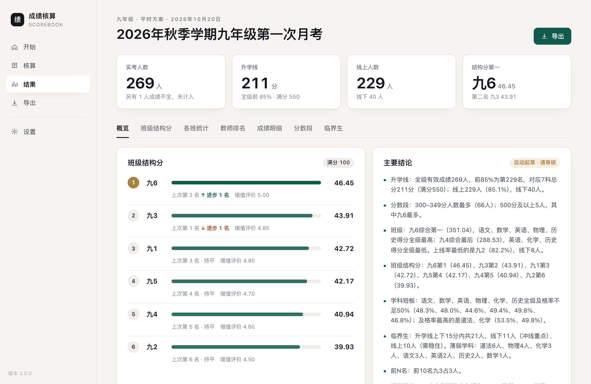
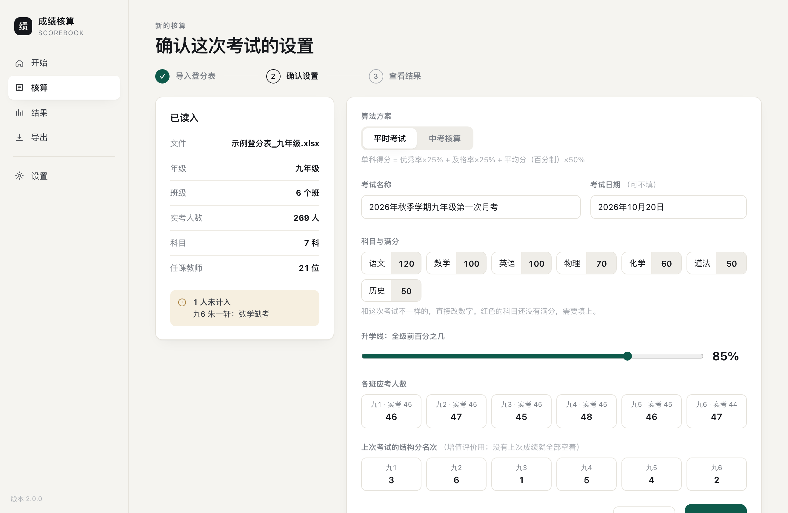
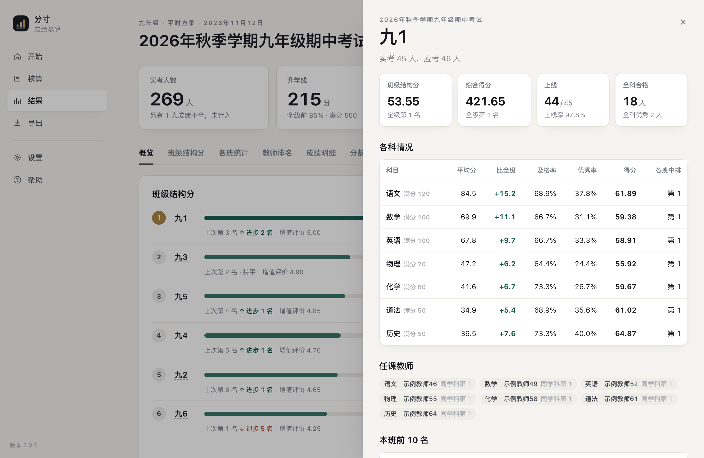
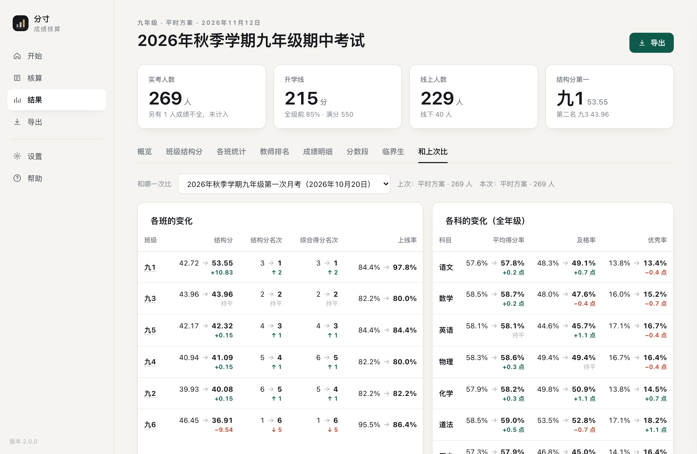

# 分寸 · 成绩核算

给初中教务处、年级组用的考试成绩核算软件。把一个年级的登分表拖进去，几秒钟算出：

- **班级结构分**：平均成绩、全科合格率、全科优秀率、参考率、增值评价（或中考的进线率、前 10 名加分），全级各班评比
- **各班成绩统计**：各科平均分、及格率、优秀率、单科得分，班级综合得分和名次
- **教师成绩排名**：按所教班级的学生合并计算，同学科内排名
- **成绩明细**：每个学生的总分、级名次、班名次，可搜索、按班筛选、点表头排序
- **班级详情**：点一个班，看它各科和全级的对比、任课教师、前 10 名、临界生
- **和上次比**：同年级两次考试之间，各班、各科、学生名次的变化，上次的临界生这次怎么样了；可以导出到 Excel 和 PDF
- **分数段、升学线、临界生名单**（含每个临界生最薄弱的学科）

结果可以导出成**带公式的 Excel**（改参数自动重算）和可以直接发到教师群的 **PDF**（导出哪些内容自己勾选）。

七、八、九年级通用；平时考试和中考核算各有一套算法和固定科目；科目、满分、各项比例都可以改。
**成绩只保存在你自己的电脑上，不会上传。** 程序只在检查和下载更新时访问 GitHub 上本项目的发布页，不发送任何成绩数据；没有网络也照常使用。



| 确认设置 | 班级详情 | 和上次比 |
|---|---|---|
|  |  |  |

（截图里都是虚构的示例数据。）

## 一、下载

到 [Releases 页面](../../releases/latest) 下载，不用安装 Python：

| 电脑 | 下载 | 打开 |
|---|---|---|
| Windows 10 / 11 | `chengji-tool-…-windows.zip` | 解压到固定的地方（如 D 盘），双击“分寸.exe” |
| Mac（Apple 芯片） | `chengji-tool-…-mac.zip` | 解压，把“分寸”拖进“应用程序”，双击打开 |

> 程序没有购买数字签名，第一次打开系统会拦一下：
> Windows 点“更多信息”→“仍要运行”；Mac 到“系统设置 → 隐私与安全性”里点“仍要打开”。

**试用与激活**：下载的安装包第一次打开起免费试用 3 天；到期后仍可核算和查看结果，导出 Excel、PDF 需要激活码。
激活码按电脑发放：在软件里点“输入激活码”，把机器码发给管理员（见下面的[联系方式](#联系方式)）。

**更新**：从 v2.0.2 起，打开程序时会查一下有没有新版本，有就提示；点“立即更新”会自动下载、换上新版本并重新打开，成绩、设置、任课总表和激活状态都不受影响（帮助 → 关于 里也可以手动检查）。**还在用 v2.0.1 及更早版本的，需要手动下载一次新版**，之后就能一键更新了。Mac 版请先把“分寸”拖进“应用程序”再打开，才能一键更新。

## 二、第一次使用（只做一次）

1. 点左边的“设置”，把学校名称和落款改成自己学校的，看一下各科满分，点“保存”。
2. 在“设置 → 任课总表”里点“在这里编辑”，直接填；也可以下载空白模板用 Excel 填好再“导入一份”：
   - 「任课总表」：年级、学科、教师、任教班级（如 `九1、九2`）；
   - 「班级信息」：各班应考人数（算参考率用）。不填也行：没填的班按实考人数算，参考率按 100%。

   不导入任课总表也能算，只是没有教师排名。

## 三、每次考试

1. **登分**：“开始”页可以直接下载各年级的空白登分表和任课总表（点一下，自己选存在哪里），科目已经设好；也可以用自己的表（要求见下）。

   | 模板 | 科目 |
   |---|---|
   | 七年级 | 语文、数学、英语、道法、历史、生物、地理 |
   | 八年级 | 上面 7 科 + 物理 |
   | 九年级 | 语文、数学、英语、物理、化学、道法、历史 |
   | 中考 | 语文、数学、英语、物理、化学、道法、历史、生物、地理、体育 |

2. **导入**：把登分表拖进“开始”页。
3. **确认设置**：算法方案（平时 / 中考）、考试名称和日期、各科满分、升学线比例、各班应考人数、上次考试的两率一分名次（增值评价用，没有就空着），点“开始计算”。
4. **看结果**：概览、班级结构分、各班统计、教师排名、成绩明细、分数段、临界生。
5. **导出**：Excel 一键导出；PDF 勾选要哪几项。同年级算过别的考试时，可以选“和上次比”：Excel 里多出“和上次比”“名次进退”“上次临界生”三张表，PDF 里可以勾选“和上次比”两页。

以前算过的考试，在“开始”页的“最近的考试”里点一下就能回看、再导出，也可以改名、删除。同一个年级再算时，上次的两率一分名次和应考人数会自动带进来。
第一次用可以先点“用示例数据试一试”看看效果。结论文字是程序自动起草的，**请审核后再发**。

### 登分表的要求

- 有一行表头，包含 `班级`、`姓名` 和科目名称（`考号` 可选）；表头上方有标题行没关系。
- **班级写法：年级用汉字，班号用数字**，如 `七1`、`八3`、`九6`。一张表只放一个年级。
- **哪一列有成绩，就统计哪一科**；本次没考的科目，那一列空着就行。和这个年级的固定科目相比少了或多了，程序会提醒一句，照样能算。
- 缺考、请假、转学：那一格留空或写“缺考”，这名学生不计入统计，并会列出来；**0 分是真实成绩，照常计入**。
- 科目名称可以写别名（如 `道德与法治`、`政治` 都认作 `道法`）。
- **加一门科目也行**：在后面加一列，表头写科目名称（如 `信息技术`），下面填分数，程序会把它当作新科目一起统计，满分当场填；用过一次就记住了。
- 序号、考号、总分、名次、备注这类列不会被当成科目。万一有一列被误当成科目，在确认设置时点它右边的 × 即可本次不计。

### 文件在哪里

- Windows：都在“分寸”文件夹里。`output` 是结果，`data` 是任课总表，`config` 是学校设置，`templates` 是空白模板，`samples` 是虚构的示例数据。
- Mac：在“文稿 → 分寸成绩核算”文件夹里，结构同上。

## 四、怎么算的

及格线 = 满分 × 60%，优秀线 = 满分 × 80%。人数只有两个叫法：**应考人数**（应该参加考试的在籍学生）、**实考人数**（各科成绩齐全、计入统计的学生）。

**单科得分**（班级、教师都用它；班级综合得分 = 各科得分之和）

| 方案 | 单科得分 | 用于 |
|---|---|---|
| 平时（默认） | 优秀率×25% + 及格率×25% + 平均分（折算百分制）×50% | 七、八、九年级平时考试 |
| 中考 | 平均分（原始分）×60% + 合格率×40% | 九年级中考成绩核算 |

**班级结构分**（各项直接按比例折分：比率 × 分值）

| 项目 | 平时 | 中考 |
|---|---|---|
| 平均成绩（本班总分平均 ÷ 总分满分） | 50 | 50 |
| 全科合格率（每一科都合格的学生 ÷ 实考人数） | 20 | 15 |
| 全科优秀率（每一科都优秀的学生 ÷ 实考人数） | 20 | 15 |
| 参考率（实考人数 ÷ 应考人数；没填应考人数就按 100%） | 5 | 10 |
| 进线率（升学线以上人数 ÷ 实考人数） | — | 10 |
| 增值评价 | 5 | — |
| 前 10 名加分（全级前 10 名每人给本班加） | — | 0.1 |

增值评价：按“两率一分”（平均成绩、全科合格率、全科优秀率三项得分之和，也叫“二率一分”，不含参考率）排名，第 1 名 5 分，每低一名减 0.1；再和上次考试的两率一分名次比，每进步一名加 0.05、退步一名减 0.05，最高 5 分。
综合结构分 = 平均成绩 + 全科合格率 + 全科优秀率 + 参考率 + 增值评价。

**其他**

- 教师成绩：所教班级的学生合并成一个整体计算，只在同学科内排名。
- 升学线：全级总分前 N%（默认 85%）对应名次的总分，同分全部计入线上。
- 临界生：升学线上下 15 分以内；薄弱学科按得分率（成绩 ÷ 满分）判断。

以上都是默认值。**各项占多少可以在软件的“设置 → 算法”里直接改**（合计要等于 100%），改了之后新算的考试按新比例，以前算过的考试不变；随时可以恢复默认。
想再加一套自己的方案，可以在 `config/学校设置.yaml` 里照样子添加。

## 五、常见问题

- **提示“文件写不进去”**：结果 Excel 正被 Excel/WPS 打开着，关掉再导出。
- **没有生成 PDF**：电脑上要有 Edge 或 Chrome 浏览器（Windows 10/11 自带 Edge）。Excel 不受影响。
- **某一科没被统计**：看“已读入”下面的提示，多半是科目名称写法不认识，改成标准名称或在设置里加别名。
- **有学生没计入**：他有一科是空的或写了“缺考”。导入后会列出是谁、缺哪科。
- **改了一个分数想重算**：重新导入再算一遍；用同一个考试名称会覆盖原结果（界面会提醒）。
- **换了电脑**：把数据文件夹整个拷过去；激活码需要按新电脑的机器码重新申请。

## 六、用源码运行

需要 Python 3.10 或更高版本。用源码运行的是不带试用限制的开源版本。

```
pip install -r requirements.txt
python -m chengji                      # 打开图形界面
python -m chengji --browser            # 没有窗口组件时，用浏览器打开界面
python -m chengji 登分表.xlsx --方案 中考 --考试 名称 --不确认    # 命令行方式（批量、自动测试用，见 --help）
```

Mac 上也可以双击 `启动（Mac）.command`，第一次会自动准备环境。

## 七、开发

```
pip install -r requirements-dev.txt
python -m pytest -q                 # 单元测试 + 界面端到端测试（只用虚构数据）
python tests/verify_all.py          # 用 LibreOffice 重算导出的 Excel，与程序独立计算逐项核对（必须 0 处不一致）
python tools/make_templates.py      # 重新生成模板和虚构示例数据
python packaging/build.py           # 打包成双击就能用的程序（Windows / Mac）
python packaging/smoke_test.py      # 用打好的程序自检、试跑，再走一遍一键更新
```

结构：`chengji/` 里 `loader / analysis / excel_report / pdf_report` 是计算核心，`service` 是界面和命令行共用的一层，
`server` 是只在本机监听的小服务，`ui/index.html` 是界面，`gui` 负责开窗口，`compare` 是两次考试的对比，`updater` 是检查和一键更新。
每次推送，GitHub Actions 会自动跑测试、核对公式、在 Windows 和 Mac 上打包并试跑；推送 `v1.2.3` 这样的标签会自动发布到 Releases。
计算规则的细节和约定见 [CLAUDE.md](CLAUDE.md)，更新记录见 [CHANGELOG.md](CHANGELOG.md)。

**数据安全**：`data/`、`output/` 和所有成绩 Excel、PDF 都不会进入仓库（见 `.gitignore`）；仓库里只有程序、模板和 `samples/` 里的虚构数据。
试用与激活的验证模块不在本仓库中，只在打包正式安装包时加入。

## 联系方式

如有问题、建议或需要激活码，欢迎通过以下方式联系：

- **邮箱**：zhaihuibo@gmail.com
- **微信**：915274394（扫码添加）
- **GitHub Issues**：[提交 Issue](https://github.com/lumanman996/chengji-tool/issues)

<p align="center">
  
</p>

## 许可证

[MIT](LICENSE)：源码可以免费使用、修改、分发。
