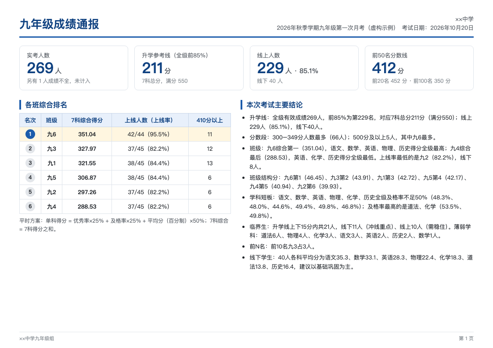
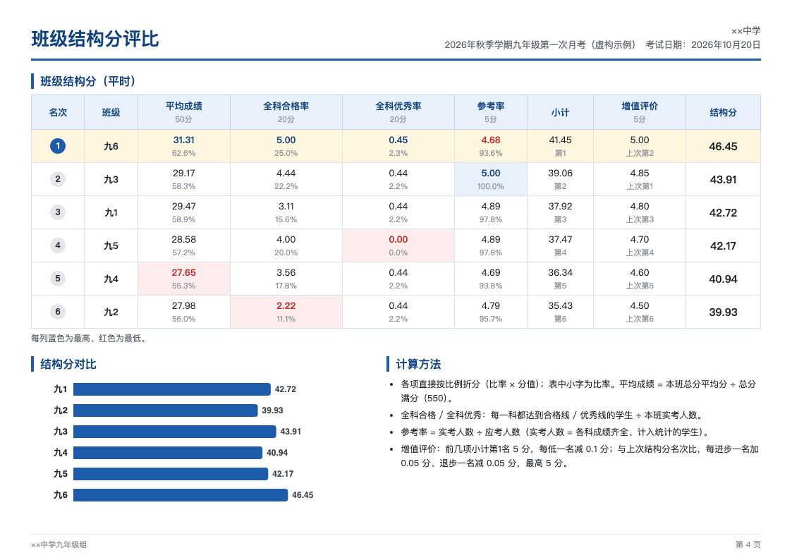
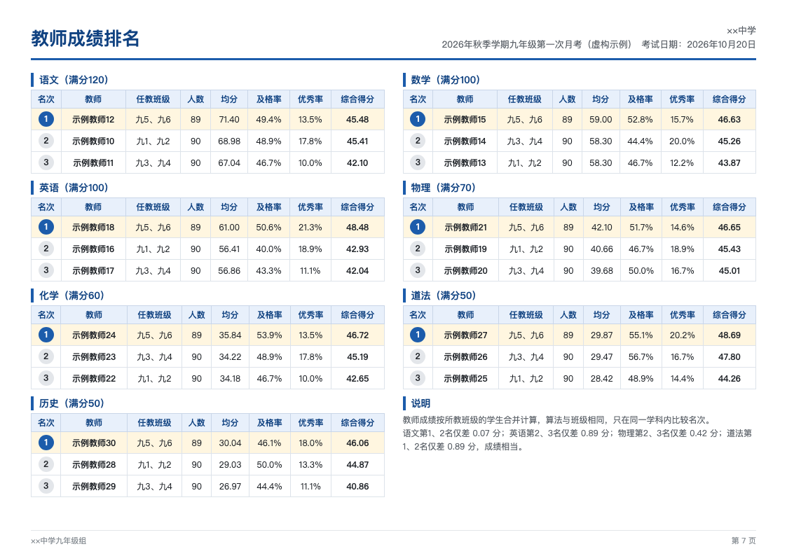

# 成绩核算工具

给初中教务处、年级组用的考试成绩核算工具。把一个年级的登分表交给它，几秒钟算出：

- **各班成绩统计**：各科平均分、及格率、优秀率、单科得分，班级综合得分和名次
- **班级结构分**：平均成绩、全科合格率、全科优秀率、参考率、增值评价（或中考的进线率、前 10 名加分），全级各班评比
- **教师成绩排名**：按所教班级的学生合并计算，同学科内排名
- **成绩明细**：每个学生的总分、级名次、班名次；序号随筛选自动重排
- **分数段、前 N 名、升学线、临界生名单**（含每个临界生最薄弱的学科）

结果是一份**带公式的 Excel**（改参数自动重算）和一份可以直接发到教师群的 **PDF**（导出哪些内容可以自己选）。

七、八、九年级通用；平时考试和中考核算各有一套算法和固定科目；科目、满分、各项比例都可以在设置文件里改。
**不联网，成绩只保存在你自己的电脑上。**

| 成绩通报 | 班级结构分 | 教师排名 |
|---|---|---|
|  |  |  |

（以上都是虚构的示例数据。）

## 一、下载（Windows，不用安装任何东西）

1. 到 [Releases 页面](../../releases/latest) 下载 `chengji-tool-…-windows.zip`。
2. 解压到一个固定的地方（比如 D 盘），得到“成绩核算工具”文件夹。
3. 双击里面的 **成绩核算工具.exe** 就能用。

> 第一次双击如果提示“Windows 已保护你的电脑”，点“更多信息”→“仍要运行”。这是因为程序没有购买数字签名，不是病毒；源代码全部公开在这里。

想先试试：把 `samples` 文件夹里的“示例登分表_九年级.xlsx”拖进窗口，一路按回车（问应考人数时输入 `九1=46 九2=47 九3=45 九4=48 九5=46 九6=47`）。

Mac 或想用源码运行的，见[第六节](#六mac--用源码运行)。

## 二、第一次使用（只做一次）

1. 用记事本打开 `config/学校设置.yaml`，把“××中学”改成自己学校的名称；看一下各科满分、算法比例对不对。
2. 把 `templates/任课总表_模板.xlsx` 复制到 `data` 文件夹，改名为 `任课总表.xlsx`，按全校实际填写（黄色示例行先删掉）：
   - 「任课总表」：年级、学科、教师、任教班级（如 `九1、九2`）；
   - 「班级信息」：各班应考人数（算参考率用，不填的话每次运行时会问）。

   不填任课总表也能算，只是没有教师排名。

## 三、每次考试

1. **登分**：`templates` 里按年级各有一张空白登分表，科目已经设好，直接用；也可以用自己的表（要求见下）。

   | 模板 | 科目 |
   |---|---|
   | `登分表_七年级.xlsx` | 语文、数学、英语、道法、历史、生物、地理 |
   | `登分表_八年级.xlsx` | 上面 7 科 + 物理 |
   | `登分表_九年级.xlsx` | 语文、数学、英语、物理、化学、道法、历史 |
   | `登分表_中考.xlsx` | 语文、数学、英语、物理、化学、道法、历史、生物、地理、体育 |

   各年级考哪几科写在 `学校设置.yaml` 的“年级科目”里，和这里不一样的学校改那里即可。
2. **双击程序**，把登分表拖进窗口，按回车。
3. **回答几个问题**，大多数直接回车就行：

   | 问题 | 说明 |
   |---|---|
   | 算法方案 | 平时（默认）或 中考 |
   | 考试名称、日期 | 名称就是结果文件夹的名字；重名会提醒 |
   | 满分 | 列出识别到的科目和满分，不对就当场改，如 `数学=120`；还没定满分的科目会逐个问 |
   | 升学线比例 | 默认全级前 85%，可改成 `80%` |
   | 应考人数 | 「班级信息」里没填的班才问，如 `九1=46 九2=45` |
   | 上次名次 | 平时方案的增值评价用，如 `九1=3 九2=1`；没有上次成绩直接回车 |
   | PDF 要哪些内容 | 8 项里选，输入序号如 `1 4 7`；`0` = 这次不要 PDF |

4. **看结果**：算完自动打开 `output/考试名称/` 文件夹。

   | 文件 | 说明 |
   |---|---|
   | `…_各班综合统计.xlsx` | 每次都有。各班统计、班级结构分、教师排名、分数段、临界生名单、参数设置、成绩明细、任课安排 |
   | `…_成绩发布版.pdf` | 按所选内容导出，A4 横版 |
   | `核对说明.txt` | 本次的满分、人数、未计入的学生、数据检查提示、自动起草的结论 |

   发布前请看一遍核对说明；结论文字是程序自动起草的，**请审核后再发**。

### 登分表的要求

- 有一行表头，包含 `班级`、`姓名` 和科目名称（`考号` 可选）；表头上方有标题行没关系。
- **班级写法：年级用汉字，班号用数字**，如 `七1`、`八3`、`九6`。一张表只放一个年级。
- **哪一列有成绩，就统计哪一科**；本次没考的科目，那一列空着就行。和这个年级的固定科目相比少了或多了，程序会提醒一句，照样能算。
- 缺考、请假、转学：那一格留空或写“缺考”，这名学生不计入统计，会在核对说明里列出；**0 分是真实成绩，照常计入**。
- 科目名称可以写别名（如 `道德与法治`、`政治` 都认作 `道法`），别名在 `学校设置.yaml` 里可以加。
- 表头里认不出的列（如 `信息技术`、`总分`）会被忽略并提示，不会悄悄算错。

## 四、怎么算的

及格线 = 满分 × 60%，优秀线 = 满分 × 80%。人数只有两个叫法：**应考人数**（应该参加考试的在籍学生）、**实考人数**（各科成绩齐全、计入统计的学生）。

**单科得分**（班级、教师都用它；班级综合得分 = 各科得分之和）

| 方案 | 单科得分 | 用于 |
|---|---|---|
| 平时（默认） | 优秀率×25% + 及格率×25% + 平均分（折算百分制）×50% | 七、八、九年级平时考试 |
| 中考 | 平均分（原始分）×60% + 合格率×40% | 九年级中考成绩核算 |

**班级结构分**（各项直接按比例折分：比率 × 分值）

| 项目 | 平时 | 中考 |
|---|---|---|
| 平均成绩（本班总分平均 ÷ 总分满分） | 50 | 50 |
| 全科合格率（每一科都合格的学生 ÷ 实考人数） | 20 | 15 |
| 全科优秀率（每一科都优秀的学生 ÷ 实考人数） | 20 | 15 |
| 参考率（实考人数 ÷ 应考人数） | 5 | 10 |
| 进线率（升学线以上人数 ÷ 实考人数） | — | 10 |
| 增值评价 | 5 | — |
| 前 10 名加分（全级前 10 名每人给本班加） | — | 0.1 |

增值评价：先把其他四项加起来排名，第 1 名 5 分，每低一名减 0.1；再和上次考试的结构分名次比，每进步一名加 0.05、退步一名减 0.05，最高 5 分。

**其他**

- 教师成绩：所教班级的学生合并成一个整体计算，只在同学科内排名。
- 升学线：全级总分前 N%（默认 85%）对应名次的总分，同分全部计入线上。
- 临界生：升学线上下 15 分以内；薄弱学科按得分率（成绩 ÷ 满分）判断。

以上比例、分值、方案都在 `config/学校设置.yaml` 里，可以改，也可以照样子加一套自己的方案。

## 五、常见问题

- **提示“文件写不进去”**：结果 Excel 正被 Excel/WPS 打开着，关掉再算一次。
- **没有生成 PDF**：电脑上要有 Edge 或 Chrome 浏览器（Windows 10/11 自带 Edge）。Excel 不受影响。
- **某一科没被统计**：看核对说明里“已忽略的列”，多半是科目名称写法不认识，改成标准名称或在设置里加别名。
- **有学生没计入**：他有一科是空的或写了“缺考”。核对说明里列着是谁、缺哪科。
- **改了一个分数想重算**：再算一遍即可；用同一个考试名称会覆盖原结果（程序会提醒）。
- **换了电脑**：把整个文件夹拷过去就行，设置和以前的结果都在里面。

## 六、Mac / 用源码运行

需要 Python 3.10 或更高版本。

- **Mac**：下载源码（绿色 Code 按钮 → Download ZIP）解压，双击 `启动（Mac）.command`。第一次会自动准备环境（要联网）。
  如果提示无法打开，在文件上点右键 → 打开。
- **命令行**（任何系统）：

  ```
  pip install -r requirements.txt
  python -m chengji                      # 问答式
  python -m chengji 登分表.xlsx --方案 中考 --考试 名称 --升学比例 80% --不确认   # 全部用参数
  python -m chengji --help               # 查看所有选项
  ```

## 七、开发

```
pip install -r requirements-dev.txt
python -m pytest -q                 # 单元测试（只用虚构数据）
python tests/verify_all.py          # 用 LibreOffice 重算导出的 Excel，与程序独立计算逐项核对（必须 0 处不一致）
python tools/make_templates.py      # 重新生成模板和虚构示例数据
python packaging/build.py           # 打包成免安装程序
python packaging/smoke_test.py      # 用打好的程序试跑
```

每次推送，GitHub Actions 会自动跑测试、核对公式、在 Windows 上打包并试跑；推送 `v1.2.3` 这样的标签会自动发布到 Releases。
计算规则的细节和约定见 [CLAUDE.md](CLAUDE.md)，更新记录见 [CHANGELOG.md](CHANGELOG.md)。

**数据安全**：`data/`、`output/` 和所有成绩 Excel、PDF 都不会进入仓库（见 `.gitignore`）；仓库里只有程序、模板和 `samples/` 里的虚构数据。

## 许可证

[MIT](LICENSE)：可以免费使用、修改、分发。
